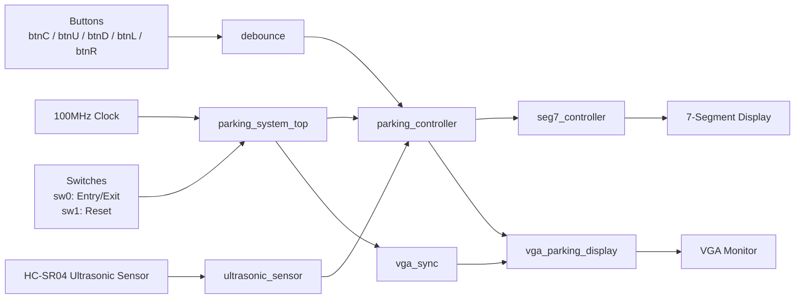
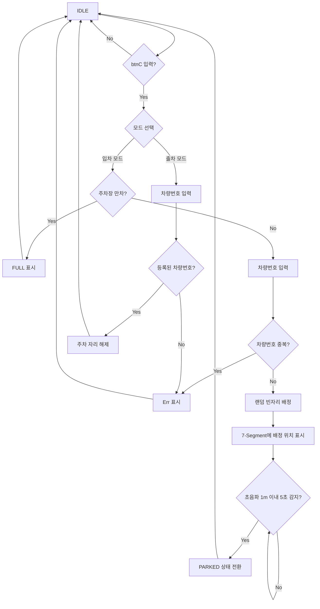

# 🅿️ Project_4 Parking System 🅿️
<br>

## 📌 1. Project Summary (프로젝트 요약)

Basys3 FPGA 보드에서 Verilog RTL 설계로 구현한 **초음파 센서 기반 주차장 관리 시스템**


<br>

## ✨ 2. Key Features (주요 기능)

- `sw[0]` 스위치로 입차 모드와 출차 모드를 선택
- `btnC` 버튼으로 입차/출차 동작 시작 및 입력 확정
- 차량번호 입력 후 입차 시 빈자리 자동 배정, 출차 시 등록된 차량번호 검색 후 자리 해제
- HC-SR04 초음파 센서를 사용해 차량 감지
- VGA 640x480 해상도로 주차장 상태 표시

<br>


## ⚙️ 3. Tech Stack (기술 스택)

### 3.1 Language (사용 언어)


### 3.2 Development Environment (개발 환경)


<br>

## 📂 4. Project Structure (프로젝트 구조)

### Project Tree (프로젝트 트리)

```text
parking_system/
├── parking_system.xpr                         # Vivado 프로젝트 파일
├── parking_system.srcs/
│   ├── sources_1/
│   │   └── imports/parking_system/
│   │       ├── parking_system_top.v            # 최상위 모듈
│   │       ├── parking_controller.v            # 주차장 제어 FSM
│   │       ├── ultrasonic_sensor.v             # HC-SR04 초음파 센서 제어
│   │       ├── vga_sync.v                      # VGA 동기 신호 생성
│   │       ├── vga_parking_display.v           # VGA 주차장 화면 출력
│   │       ├── seg7_controller.v               # 7-Segment 표시 제어
│   │       ├── debounce.v                      # 버튼 디바운스 및 원펄스 처리
│   │       └── parking_system_tb.v             # 시뮬레이션 테스트벤치
│   │
│   └── constrs_1/
│       └── imports/parking_system/
│           └── parking_system.xdc              # Basys3 핀 제약 조건
│
├── parking_system.sim/                         # Vivado 시뮬레이션 결과
├── parking_system.runs/                        # 합성/구현/비트스트림 결과
└── README.md                                   # 프로젝트 설명 문서
```
---
<br>

## 🧩 5. System Design (시스템 설계)

### 5.1 Hardware Block Diagram (하드웨어 블록다이어그램)



### 5.2 System Flow Chart (동작 흐름도)



---

## 6. I/O Control (입출력 제어)

| Input / Output | Function |
|---|---|
| `sw[0]` | 입차/출차 모드 선택, `0`: 입차, `1`: 출차 |
| `sw[1]` | 시스템 리셋 |
| `btnC` | 시작 및 확인 |
| `btnU` | 현재 자릿수 숫자 증가 |
| `btnD` | 현재 자릿수 숫자 감소 |
| `btnL` | 입력 위치 왼쪽 이동 |
| `btnR` | 입력 위치 오른쪽 이동 |
| `ultra_trig` | 초음파 센서 Trigger 출력 |
| `ultra_echo` | 초음파 센서 Echo 입력 |
| `vga_r/g/b`, `vga_hs`, `vga_vs` | VGA 화면 출력 |
| `seg`, `an`, `dp` | 7-Segment 출력 |

---

## 🎬 7. Demonstration (시연 영상)

<br><br>

<p> <a href="https://www.youtube.com/watch?v=hIA0RXWNTHo">  </a> </p>

### *이미지를 클릭하면 영상으로 이동합니다*

<br><br>


## 🎯 8. Troubleshooting (문제 해결 기록)

### 8.1 빈자리 표시 문제

**🔍 문제 상황**

- 주차 공간이 얼마 없는 상황일 때, 화면에서 빈자리를 한 눈에 찾기 어려움

**❓ 원인 분석**

- 빈자리가 많을 때는 상관없지만, 빈자리가 줄어들수록 수가 적어져 눈에 띄기 힘들다

**❗ 해결 방법**

- 남은 빈자리가 2개 이하일 때 초록색 점이 깜빡이도록 로직을 추가

**✅ 결과**

- 주차 공간이 얼마 남지 않았을 때, VGA 화면에서 확인하기 용이하게 됨
---

### 8.2 주차 위치 확인 문제

**🔍 문제 상황**

- 차량이 입차 처리된 직후 바로 주차 완료 상태로 표시하면 어디에 차량이 주차했는지 확인하기 어려움

**❓ 원인 분석**

- 시각적으로 진행상황을 확인할 수 있는 단계가 필요

**❗ 해결 방법**

- 차량이 초음파 센서에 감지됐을 때, VGA화면에 3초간 깜빡이는 로직을 넣음

**✅ 결과**

- 차량이 주차 완료되었을 때 해당 자리에 3초간 점으로 깜빡이면서 표시되어, 주차된 위치를 쉽게 확인할 수 있음

---

### 8.3 주차 완료 상태 전환 오류

**🔍 문제 상황**

- 입차시 차량 번호를 입력한 후 초음파 센서에 감지되지 않았는데 해당 자리에 즉시 주차 완료로 표시되는 문제

**❓ 원인 분석**

- FSM(유한 상태 머신)을 확인한 결과, 입차 확인 시 ‘주차 완료’상태로 즉시 전환됨을 확인

**❗ 해결 방법**

-  → 중간 단계에 ‘배정됨’ 상태를 추가하여 로직을 변경
  
**✅ 결과**

- 차량 번호 입력 직후에는 해당 자리가 주차 완료가 아닌 배정 상태로 표시되도록 함
- 초음파 센서가 실제 차량을 감지한 경우에만 주차 완료 상태로 변경되어, VGA 화면의 주차 상태 표시를 정확하게 나타낼 수 있게됨

<br>


## 🔧 9. Future Improvements (개선 사항)

- Basys3 내부 클럭으로 각 자리별 주차 시간을 카운팅하고, 출차 시 경과 시간에 따라 요금을 7-seg에 표시하는 기능을 추가
- UART, Bluetooth, Wi-Fi 등을 이용해 PC 또는 모바일 화면에서 주차 상태 확인
- VGA 화면에 남은 자리 수, 차량번호 일부, 입차/출차 모드 등을 추가 표시


