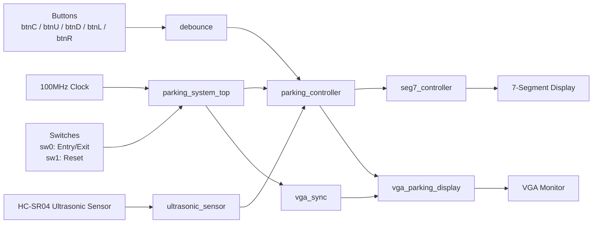
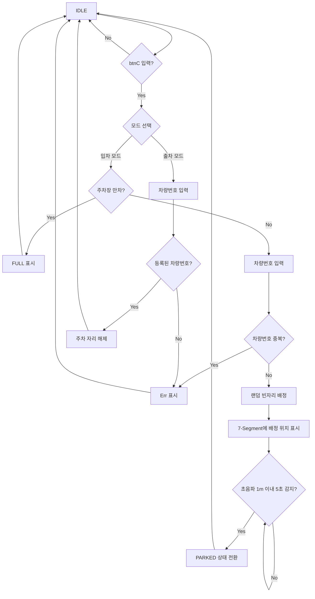

<p align="center">
  
</p>

# Project 4 Parking System

## 1. Project Summary (프로젝트 요약)

Basys3 FPGA 보드에서 Verilog RTL 설계로 구현한 **초음파 센서 기반 스마트 주차장 관리 시스템**입니다.

차량번호를 입력해 입차/출차를 처리하고, 빈 주차 공간을 자동으로 배정하며, 초음파 센서를 통해 실제 차량 주차 여부를 확인합니다. VGA 화면에는 주차장 전체 상태를 시각적으로 출력하고, 7-Segment에는 차량번호, 배정 위치, 오류 메시지 등을 표시합니다.

---

## 2. Key Features (주요 기능)

### 🚗 Entry / Exit Mode Control (입차·출차 모드 제어)

- `sw[0]` 스위치로 입차 모드와 출차 모드를 선택
- `btnC` 버튼으로 입차/출차 동작 시작 및 입력 확정
- 차량번호 입력 후 입차 시 빈자리 자동 배정, 출차 시 등록된 차량번호 검색 후 자리 해제

### 🔢 Car Number Input (차량번호 입력)

- 4자리 차량번호를 7-Segment로 표시
- `btnU`, `btnD`로 숫자 증가/감소
- `btnL`, `btnR`로 입력 자릿수 이동
- 현재 입력 중인 자릿수는 깜빡임으로 표시

### 🅿️ Random Parking Spot Assignment (랜덤 주차 자리 배정)

- 총 16개의 주차 공간을 관리
- LFSR 기반의 랜덤 시작점을 이용해 빈 주차 공간 탐색
- 입차 차량번호가 기존 등록 번호와 중복되면 `Err` 출력
- 주차장이 가득 찬 경우 `FULL` 출력

### 📡 Ultrasonic Sensor Parking Check (초음파 센서 기반 주차 확인)

- HC-SR04 초음파 센서를 사용해 차량 감지
- 1m 이내 물체가 5초 이상 연속 감지되면 해당 공간을 `PARKED` 상태로 전환
- 입차 직후에는 `ASSIGNED` 상태로 관리하고, 실제 감지 후 주차 완료 처리

### 🖥️ VGA Parking Display (VGA 주차장 화면 출력)

- VGA 640x480 해상도로 주차장 상태 표시
- 4개 층, 각 층 4개 자리 구조로 총 16개 공간 표현
- 빈자리/배정된 자리: 초록색 점
- 주차 완료 자리: 빨간색 점
- 남은 자리가 2개 이하일 때 초록색 점 깜빡임으로 경고 표시

### 🔁 FSM-based State Management (상태 머신 기반 제어)

- `IDLE`, `INPUT`, `DONE`, `SHOW_MSG` 상태로 시스템 흐름 관리
- 입차, 출차, 만차, 오류 상황을 FSM으로 분리해 제어
- 버튼 입력, 차량번호 검색, 자리 배정, 메시지 출력 흐름을 명확하게 구성

---

## 3. Tech Stack (기술 스택)

### 3.1 Language (사용 언어)


### 3.2 Development Environment (개발 환경)


### 3.3 Hardware (사용 하드웨어)


### 3.4 Collaboration Tools (협업 도구)


---

## 4. Project Structure (프로젝트 구조)

### 4.1 Project Tree (프로젝트 트리)

```text
parking_system/
├── parking_system.xpr                         # Vivado 프로젝트 파일
├── parking_system.srcs/
│   ├── sources_1/
│   │   └── imports/parking_system/
│   │       ├── parking_system_top.v            # 최상위 모듈
│   │       ├── parking_controller.v            # 주차장 제어 FSM
│   │       ├── ultrasonic_sensor.v             # HC-SR04 초음파 센서 제어
│   │       ├── vga_sync.v                      # VGA 동기 신호 생성
│   │       ├── vga_parking_display.v           # VGA 주차장 화면 출력
│   │       ├── seg7_controller.v               # 7-Segment 표시 제어
│   │       ├── debounce.v                      # 버튼 디바운스 및 원펄스 처리
│   │       └── parking_system_tb.v             # 시뮬레이션 테스트벤치
│   │
│   └── constrs_1/
│       └── imports/parking_system/
│           └── parking_system.xdc              # Basys3 핀 제약 조건
│
├── parking_system.sim/                         # Vivado 시뮬레이션 결과
├── parking_system.runs/                        # 합성/구현/비트스트림 결과
└── README.md                                   # 프로젝트 설명 문서
```

### 4.2 Main Module Description (주요 모듈 설명)

| Module | Description |
|---|---|
| `parking_system_top.v` | 전체 시스템을 연결하는 Top Module |
| `parking_controller.v` | 입차/출차, 차량번호 입력, 자리 배정, 오류 처리 담당 |
| `ultrasonic_sensor.v` | HC-SR04 Trigger/Echo 신호를 이용해 1m 이내 물체 감지 |
| `vga_sync.v` | 640x480 VGA 동기 신호 생성 |
| `vga_parking_display.v` | 주차장 층/자리/상태를 VGA 화면에 출력 |
| `seg7_controller.v` | 차량번호, 배정 위치, `FULL`, `Err` 메시지 표시 |
| `debounce.v` | 버튼 입력 안정화 및 한 번 누름 신호 생성 |
| `parking_system_tb.v` | 기능 검증용 테스트벤치 |

---

## 5. System Design (시스템 설계)

### 5.1 Hardware Block Diagram (하드웨어 블록다이어그램)



### 5.2 System Flow Chart (동작 흐름도)



---

## 6. I/O Control (입출력 제어)

| Input / Output | Function |
|---|---|
| `sw[0]` | 입차/출차 모드 선택, `0`: 입차, `1`: 출차 |
| `sw[1]` | 시스템 리셋 |
| `btnC` | 시작 및 확인 |
| `btnU` | 현재 자릿수 숫자 증가 |
| `btnD` | 현재 자릿수 숫자 감소 |
| `btnL` | 입력 위치 왼쪽 이동 |
| `btnR` | 입력 위치 오른쪽 이동 |
| `ultra_trig` | 초음파 센서 Trigger 출력 |
| `ultra_echo` | 초음파 센서 Echo 입력 |
| `vga_r/g/b`, `vga_hs`, `vga_vs` | VGA 화면 출력 |
| `seg`, `an`, `dp` | 7-Segment 출력 |

---

## 7. Demonstration (시연 영상)

### Demonstration Video (시연 영상)

<!-- 시연 영상이 있으면 아래 링크의 VIDEO_URL 부분을 유튜브 주소로 바꾸면 됩니다. -->

[](VIDEO_URL)

이미지를 클릭하면 시연 영상으로 이동합니다.

---

## 8. Troubleshooting (문제 해결 기록)

### 8.1 버튼 입력이 한 번만 눌리지 않는 문제

**Issue (문제 상황)**

- 버튼을 한 번 눌렀는데 숫자가 여러 번 증가하거나 입력이 중복되는 문제가 발생

**Analysis (원인 분석)**

- 물리 버튼의 채터링 현상으로 인해 하나의 입력이 여러 개의 신호로 인식됨

**Action (해결 방법)**

- `debounce.v` 모듈을 추가해 버튼 입력을 안정화
- Rising edge one-shot 방식으로 한 번 누를 때 하나의 펄스만 발생하도록 처리

**Result (결과)**

- 차량번호 입력과 확인 버튼 동작이 안정적으로 처리됨

---

### 8.2 입차 직후 실제 주차 여부를 구분하기 어려운 문제

**Issue (문제 상황)**

- 차량이 입차 처리된 직후 바로 주차 완료 상태로 표시하면 실제 차량이 들어왔는지 구분하기 어려움

**Analysis (원인 분석)**

- 자리 배정 상태와 실제 주차 완료 상태가 분리되어 있지 않으면 센서 검증 의미가 줄어듦

**Action (해결 방법)**

- 주차 상태를 `EMPTY`, `ASSIGNED`, `PARKED` 세 단계로 분리
- 입차 직후에는 `ASSIGNED` 상태로 저장
- 초음파 센서가 1m 이내 물체를 5초 이상 감지할 때만 `PARKED` 상태로 변경

**Result (결과)**

- 자리 배정과 실제 주차 완료를 분리해 더 정확한 주차 상태 관리가 가능해짐

---

### 8.3 중복 차량번호 및 잘못된 출차 처리 문제

**Issue (문제 상황)**

- 이미 입차된 차량번호가 다시 입력되거나, 등록되지 않은 차량번호로 출차를 시도하는 상황 발생

**Analysis (원인 분석)**

- 차량번호 검색 로직이 없으면 중복 입차와 잘못된 출차를 막을 수 없음

**Action (해결 방법)**

- `spot_car` 배열에 각 주차 공간의 차량번호 저장
- 입차 시 기존 차량번호와 비교해 중복이면 `Err` 표시
- 출차 시 등록된 차량번호가 없으면 `Err` 표시

**Result (결과)**

- 차량번호 기반 입차/출차 관리가 가능해지고 예외 상황을 사용자에게 표시할 수 있게 됨

---

### 8.4 빈자리 부족 상태를 한눈에 확인하기 어려운 문제

**Issue (문제 상황)**

- 주차 공간이 거의 남지 않았을 때 사용자가 VGA 화면만 보고 위험 상태를 즉시 파악하기 어려움

**Analysis (원인 분석)**

- 단순히 초록/빨강 점만 표시하면 빈자리 부족 상태가 강조되지 않음

**Action (해결 방법)**

- `empty_count` 신호를 컨트롤러에서 VGA 출력 모듈로 전달
- 빈자리가 2개 이하일 때 초록색 점이 깜빡이도록 구현

**Result (결과)**

- 주차 공간 부족 상태를 시각적으로 더 쉽게 확인할 수 있음

---

## 9. Future Improvements (향후 개선 방향)

- 각 주차 구역마다 초음파 센서를 배치해 모든 자리의 실제 점유 여부를 독립적으로 감지
- 차단기 모터 또는 서보모터를 추가해 입차/출차 게이트 자동 제어 구현
- UART, Bluetooth, Wi-Fi 등을 이용해 PC 또는 모바일 화면에서 주차 상태 확인
- 입차/출차 시간을 저장해 이용 시간 계산 기능 추가
- 단순 랜덤 배정이 아닌 가까운 자리 우선, 층별 우선순위 기반 배정 알고리즘 적용
- VGA 화면에 남은 자리 수, 차량번호 일부, 입차/출차 모드 등을 추가 표시
- 테스트벤치용 타이머 파라미터와 실제 하드웨어용 타이머 파라미터를 분리해 시뮬레이션 속도 개선

---

## 10. Result (결과)

- Verilog RTL 기반의 주차장 관리 시스템을 Basys3 FPGA에서 구현
- 버튼과 스위치를 이용한 차량번호 입력 및 입차/출차 제어 구현
- LFSR 기반 빈자리 배정 로직 구현
- 초음파 센서를 이용한 실제 주차 감지 기능 구현
- VGA와 7-Segment를 활용해 사용자에게 주차 상태와 오류 메시지를 시각적으로 제공
